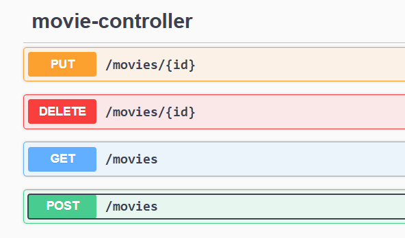

## Описание
Movie Management API — это RESTful веб-приложение на Spring Boot с базой данных H2 для управления записями о фильмах. Оно предоставляет CRUD-функциональность: создание, чтение, обновление и удаление записей.

## Используемые технологии

- Java 17
- Spring Boot 3
- Spring Data JPA
- H2 Database (In-Memory)
- Lombok
- Spring Validation 

## Запуск проекта
1. Клонируйте репозиторий.
2. Убедитесь, что у вас установлен JDK 17 и Gradle.
3. Выполните команду:

./gradlew bootRun

## Доступные API-маршруты

## Валидация и обработка ошибок
`name` и `year` — обязательные поля.

Если обязательные поля отсутствуют, API вернёт ошибку 400 Bad Request с сообщением вида:

`{ "error": "name обязательно" }`

Если фильм с указанным id не найден, возвращается 404 Not Found.